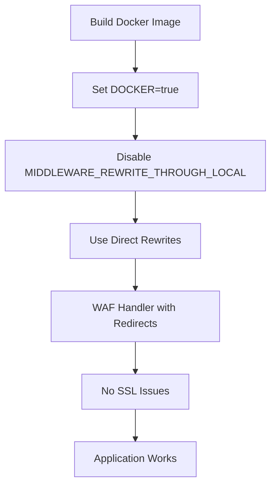

# Docker SSL Fix for Lobe Chat

## 🔍 **Vấn đề**

Khi build Docker container, gặp lỗi SSL khi truy cập URL sau khi rewrite. Nguyên nhân chính là:

1. **Internal Rewrite Issues**: `MIDDLEWARE_REWRITE_THROUGH_LOCAL=1` tạo internal requests đến `127.0.0.1`
2. **Docker Network**: Container không thể resolve `127.0.0.1` đúng cách
3. **SSL Context Loss**: SSL context bị mất khi thực hiện internal rewrites

## 🛠️ **Giải pháp đã áp dụng**

### **1. Disable Local Rewrite trong Docker**
```bash
# Trong Dockerfile.database
ENV MIDDLEWARE_REWRITE_THROUGH_LOCAL="0" \
    DOCKER="true"
```

### **2. Cập nhật Middleware Logic**
- Detect Docker environment
- Skip internal rewrites khi `DOCKER=true`
- Sử dụng direct rewrites thay vì local rewrites

### **3. WAF Handler với Redirect Fallback**
- Sử dụng `NextResponse.redirect()` thay vì `NextResponse.rewrite()` trong Docker
- Fallback mechanism cho SSL errors

## 🚀 **Cách sử dụng**

### **Option 1: Build và test với script**
```bash
# Make script executable
chmod +x build-and-test-docker.sh

# Build và test
./build-and-test-docker.sh
```

### **Option 2: Manual build**
```bash
# Build image
docker build -f Dockerfile.database -t lobe-chat:ssl-fixed .

# Run container
docker run -d \
  --name lobe-chat \
  -p 3210:3210 \
  -e DOCKER=true \
  -e MIDDLEWARE_REWRITE_THROUGH_LOCAL=0 \
  -e NODE_TLS_REJECT_UNAUTHORIZED=0 \
  -e ACCESS_CODE=your_access_code \
  lobe-chat:ssl-fixed
```

### **Option 3: Docker Compose**
```bash
# Sử dụng docker-compose file đã được cấu hình
docker-compose -f docker-compose.ssl-fixed.yml up -d
```

## 🔧 **Environment Variables**

### **Bắt buộc:**
```bash
DOCKER=true                                    # Enable Docker mode
MIDDLEWARE_REWRITE_THROUGH_LOCAL=0            # Disable local rewrites
```

### **SSL Configuration (backup):**
```bash
NODE_TLS_REJECT_UNAUTHORIZED=0                # Allow self-signed certs
NODE_TLS_CIPHER_SUITE=ALL                     # Allow all ciphers
NODE_TLS_SECURE_OPTIONS=0                     # Disable secure options
SSL_CERT_DIR=/etc/ssl/certs/ca-certificates.crt
```

### **Application:**
```bash
NODE_ENV=production
HOSTNAME=0.0.0.0
PORT=3210
ACCESS_CODE=your_access_code
APP_URL=http://localhost:3210
```

## 📊 **Testing**

### **1. Health Check**
```bash
curl -I http://localhost:3210/api/health
```

### **2. WAF URL Rewrite Test**
```bash
curl -I http://localhost:3210/static/js/test.js
```

### **3. Container Logs**
```bash
docker logs -f lobe-chat
```

### **4. Environment Check**
```bash
docker exec lobe-chat env | grep -E "(DOCKER|MIDDLEWARE|NODE_TLS)"
```

## 🐛 **Debug**

### **Script Debug**
```bash
chmod +x debug-ssl.sh
./debug-ssl.sh lobe-chat
```

### **Manual Debug**
```bash
# Check container status
docker ps | grep lobe-chat

# Check logs
docker logs --tail 50 lobe-chat

# Check environment
docker exec lobe-chat env | grep -E "(DOCKER|MIDDLEWARE|NODE_TLS|SSL)"

# Test connectivity
docker exec lobe-chat curl -I http://localhost:3210
```

## ✅ **Expected Results**

Sau khi áp dụng fix:

1. ✅ **No SSL errors** trong container logs
2. ✅ **WAF-friendly URLs** hoạt động bình thường
3. ✅ **Static files** được serve đúng cách
4. ✅ **No internal rewrite errors**
5. ✅ **Application accessible** tại `http://localhost:3210`

## 🔄 **Workflow**



## 📝 **Notes**

- **Performance**: Redirect có thể chậm hơn rewrite một chút, nhưng ổn định hơn
- **Caching**: Static files vẫn được cache bình thường
- **Security**: Không ảnh hưởng đến bảo mật của ứng dụng
- **Compatibility**: Hoạt động với tất cả WAF providers

## 🆘 **Troubleshooting**

### **Vẫn gặp SSL errors:**
1. Kiểm tra `DOCKER=true` đã được set
2. Kiểm tra `MIDDLEWARE_REWRITE_THROUGH_LOCAL=0`
3. Restart container
4. Check logs với `docker logs -f container_name`

### **WAF URLs không hoạt động:**
1. Kiểm tra WAF handler logs
2. Verify URL patterns trong middleware
3. Test với debug script

### **Performance issues:**
1. Monitor redirect frequency
2. Check if caching headers được set đúng
3. Consider CDN cho static files 