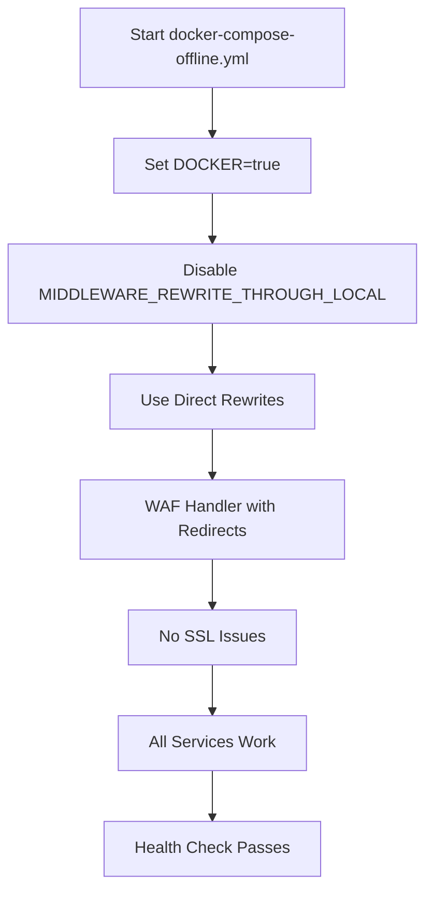

# Docker Compose Offline SSL Fix

## 🔍 **Vấn đề với docker-compose-offline.yml**

Khi sử dụng `docker-compose-offline.yml`, bạn có thể gặp lỗi SSL khi truy cập URL sau khi rewrite. Điều này xảy ra vì:

1. **Internal Rewrite Issues**: Middleware tạo internal requests đến `127.0.0.1`
2. **Docker Network**: Container không thể resolve `127.0.0.1` đúng cách
3. **SSL Context Loss**: SSL context bị mất khi thực hiện internal rewrites

## 🛠️ **Giải pháp đã áp dụng**

### **Environment Variables đã thêm vào service `lobe`:**

```yaml
environment:
  # Docker environment flags - Fix SSL issues
  - 'DOCKER=true'
  - 'MIDDLEWARE_REWRITE_THROUGH_LOCAL=0'
  
  # SSL Configuration - Backup fix
  - 'NODE_TLS_REJECT_UNAUTHORIZED=0'
  - 'NODE_TLS_CIPHER_SUITE=ALL'
  - 'NODE_TLS_SECURE_OPTIONS=0'
  - 'SSL_CERT_DIR=/etc/ssl/certs/ca-certificates.crt'
```

### **Health Check đã thêm:**

```yaml
healthcheck:
  test: ["CMD", "curl", "-f", "http://localhost:${LOBE_PORT}/api/health"]
  interval: 30s
  timeout: 10s
  retries: 3
  start_period: 40s
```

## 🚀 **Cách sử dụng**

### **1. Sử dụng script test (Khuyến nghị)**
```bash
# Chuyển đến thư mục docker-compose-self
cd docker-compose-self

# Make script executable
chmod +x test-offline-ssl.sh

# Chạy test
./test-offline-ssl.sh
```

### **2. Manual commands**
```bash
# Chuyển đến thư mục docker-compose-self
cd docker-compose-self

# Stop existing containers
docker-compose -f docker-compose-offline.yml down

# Start with SSL fixes
docker-compose -f docker-compose-offline.yml up -d

# Check logs
docker-compose -f docker-compose-offline.yml logs -f lobe-chat
```

### **3. Kiểm tra environment variables**
```bash
# Check if SSL fixes are applied
docker-compose -f docker-compose-offline.yml exec lobe-chat env | grep -E "(DOCKER|MIDDLEWARE|NODE_TLS|SSL)"
```

## 🔧 **Environment Variables quan trọng**

### **Bắt buộc cho SSL fix:**
```bash
DOCKER=true                                    # Enable Docker mode
MIDDLEWARE_REWRITE_THROUGH_LOCAL=0            # Disable local rewrites
```

### **SSL Configuration (backup):**
```bash
NODE_TLS_REJECT_UNAUTHORIZED=0                # Allow self-signed certs
NODE_TLS_CIPHER_SUITE=ALL                     # Allow all ciphers
NODE_TLS_SECURE_OPTIONS=0                     # Disable secure options
SSL_CERT_DIR=/etc/ssl/certs/ca-certificates.crt
```

## 📊 **Testing**

### **1. Health Check**
```bash
# Check if service is healthy
docker-compose -f docker-compose-offline.yml ps
```

### **2. Test WAF URL Rewrite**
```bash
# Get LOBE_PORT from .env
LOBE_PORT=$(grep "LOBE_PORT=" .env | cut -d'=' -f2 || echo "3210")

# Test WAF-friendly URL
curl -I "http://localhost:$LOBE_PORT/static/js/test.js"
```

### **3. Check SSL Errors**
```bash
# Check for SSL errors in logs
docker-compose -f docker-compose-offline.yml logs lobe-chat | grep -i "ssl\|tls\|certificate\|rewrite"
```

## 🐛 **Debug**

### **1. Check container status**
```bash
docker-compose -f docker-compose-offline.yml ps
```

### **2. Check environment variables**
```bash
docker-compose -f docker-compose-offline.yml exec lobe-chat env | grep -E "(DOCKER|MIDDLEWARE|NODE_TLS|SSL)"
```

### **3. Check logs**
```bash
docker-compose -f docker-compose-offline.yml logs -f lobe-chat
```

### **4. Test connectivity**
```bash
# Test internal connectivity
docker-compose -f docker-compose-offline.yml exec lobe-chat curl -I http://localhost:${LOBE_PORT}
```

## ✅ **Expected Results**

Sau khi áp dụng fix:

1. ✅ **No SSL errors** trong container logs
2. ✅ **WAF-friendly URLs** hoạt động bình thường
3. ✅ **Static files** được serve đúng cách
4. ✅ **No internal rewrite errors**
5. ✅ **Application accessible** tại `http://localhost:${LOBE_PORT}`
6. ✅ **Health check passes**

## 🔄 **Workflow với docker-compose-offline.yml**



## 📝 **Notes cho Offline Setup**

- **Network Mode**: Service sử dụng `network_mode: 'service:network-service'`
- **Dependencies**: Phụ thuộc vào PostgreSQL, MinIO, Casdoor
- **Port Mapping**: Thông qua network-service container
- **SSL Context**: Được share giữa các services

## 🆘 **Troubleshooting**

### **Vẫn gặp SSL errors:**
1. Kiểm tra `DOCKER=true` đã được set
2. Kiểm tra `MIDDLEWARE_REWRITE_THROUGH_LOCAL=0`
3. Restart service: `docker-compose -f docker-compose-offline.yml restart lobe-chat`
4. Check logs: `docker-compose -f docker-compose-offline.yml logs -f lobe-chat`

### **WAF URLs không hoạt động:**
1. Kiểm tra WAF handler logs
2. Verify URL patterns trong middleware
3. Test với script: `./test-offline-ssl.sh`

### **Service dependencies issues:**
1. Check PostgreSQL health: `docker-compose -f docker-compose-offline.yml logs postgresql`
2. Check MinIO health: `docker-compose -f docker-compose-offline.yml logs minio`
3. Check Casdoor health: `docker-compose -f docker-compose-offline.yml logs casdoor`

### **Network connectivity issues:**
1. Check network-service container: `docker-compose -f docker-compose-offline.yml logs network-service`
2. Verify port mappings: `docker-compose -f docker-compose-offline.yml ps`
3. Test internal connectivity between services

## 🎯 **Quick Commands**

```bash
# Start everything
docker-compose -f docker-compose-offline.yml up -d

# Check status
docker-compose -f docker-compose-offline.yml ps

# View logs
docker-compose -f docker-compose-offline.yml logs -f lobe-chat

# Restart lobe service
docker-compose -f docker-compose-offline.yml restart lobe-chat

# Stop everything
docker-compose -f docker-compose-offline.yml down

# Test with script
./test-offline-ssl.sh
``` 